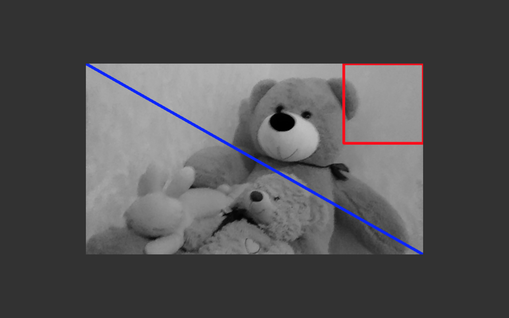

# Лаба №0: A toe into madness
  Встановити OpenCV, зчитати зображення з вебки, відобразити та записати його на диск. Після цього зчитати щойно записане зображення з диску, конвертувати у відтінки сірого та намалювати на ньому лінію по діагоналі та прямокутник довільних кольорів (наприклад червону лінію та синій прямокутник). Ні це не психотест, для дебагу це ще й як знадобиться.

# Solution
  Создан MacOs Application который добавляет на камеру "Gray Filter" рисуя поверх фигуры с условия.

